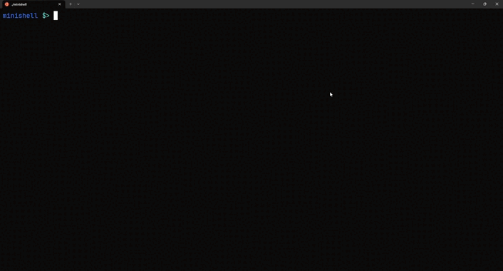

    

    
    
    
    

# Minishell
Minishell is a project from [42 Network](https://www.42.us.org/). The goal of this project is to create a simple shell, with basic functions.

## How to use

- Clone the repository with `git clone https://github.com/iLucasPires/minishell`
- Run `make` to compile the project
- Run `./minishell` to start the shell

## Requirements

- Readline library
- C compiler (gcc or clang)
- Make

## Mandatory part

- [x] The executable file must be named minishell.
- [x] You must have a Makefile which will compile the project and must contain the usual rules. Your Makefile must not relink.
- [x] Your Makefile must at least contain the rules $(NAME), all, clean, fclean and re.
- [x] The executable must not have any leaks.
- [x] The executable must not have any undefined behavior.
- [x] The executable must not crash.
- [x] The executable must not quit unexpectedly (Segmentation fault, bus error, double free, etc).
- [x] The executable must respond to the following signals: Ctrl-C, Ctrl-\ and Ctrl-D.
- [x] You must show a prompt when waiting for a new command.
- [x] The prompt must be displayed again each time a command has been executed completely.
- [x] You must correctly handle the PATH and the environment (by copying and restoring the initial envp).
- [x] You must implement the following builtins: echo, cd, setenv, unsetenv, env, exit.
- [x] You must implement the following redirections: <, >, >>.
- [x] You must implement the following pipes: |.

## Bonus part

- [ ] You must implement the following logical operators: &&, ||.
- [ ] You must implement the wildcard: *.
- [x] You must implement the syntax of quotes: ’ and ”.

## Example

## TODO

- [ ] better error handling
- [ ] better performance
- [ ] better code documentation
- [ ] improve unit tests
- [ ] improve bonus part
